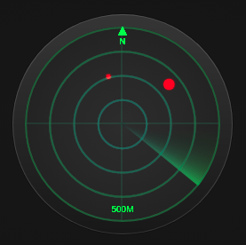

# Radar in JS Canvas

Radar rendered in JS Canvas that shows the targets defined in a JSON file.
This project has been designed for educational purposes both how JS Canvas works and notions of trigonometry. 
You can try a functional demo of the project at [https://junisan.github.io/RadarJS/](https://junisan.github.io/RadarJS/)

This project has been designed for educational purposes in the following areas:
- How Javascript Canvas works
- Webpack and how to generate final files
- Trigonometric functions (which I haven't used for many years)

I hope you enjoy learning with him.



## Table of Contents

- [Installation](#installation)
- [Usage](#usage)
- [Support](#support)
- [Thanks](#thanks)

## Installation

Clone the project on your computer with the **git clone** command and access the root directory of the project.
Then execute the following commands.

```sh
git clone https://github.com/junisan/RadarJS.git
cd RadarJS
npm install
```
The last command will install all the dependencies of this project (especially webpack and the necessary tools to "compile" it).


## Usage

If you are testing or in a development environment, run **npm run dev**. This will
create a lightweight server that will allow you to test the result in a browser
without having to do anything else. In addition, every code change you make will
be automatically displayed in the browser.

When you're happy with how the code is and everything it does, it's time to
"compile" it optimized for production. Run **npm run build** to generate the
final files (which you'll have to upload to a web server to view). These files
will be generated in the **dist** folder.

## Support

This software is distributed without any support or warranty. It has only been
used to explain to my students how various aspects of programming (and its
application in "real" problems using basic mathematics) work.

## Thanks
This Radar has been designed using the following resources
- The basic but awesome radar design by [Jvsanshu](https://codepen.io/jvsanshu/pen/qaooqp)
- The complete guide on how to install and use Webpack
 [Jeffrey Allen Lewis](https://medium.com/@jeffrey.allen.lewis/the-ultimate-2018-webpack-4-and-babel-setup-guide-npm-yarn-dependencies-compared-entry-points-866b577da6a)
- In short, the whole community that publishes free software and free resources so that people can learn.

